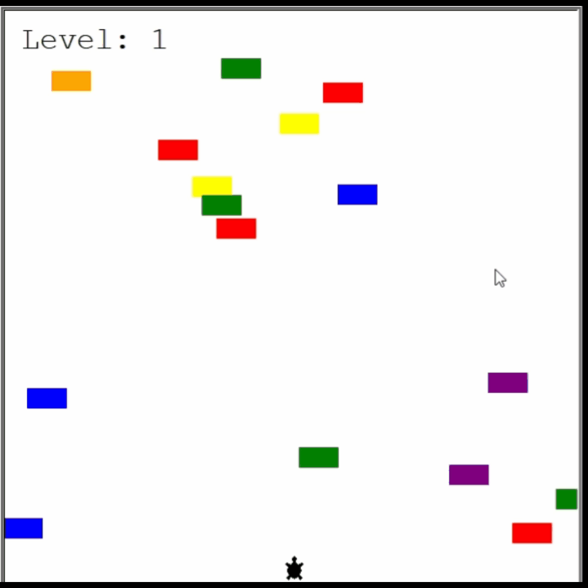
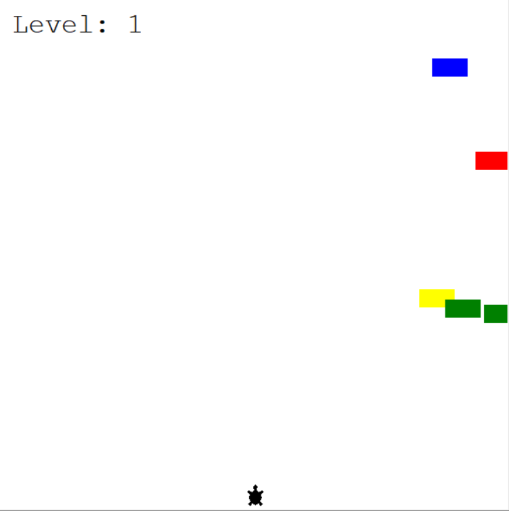
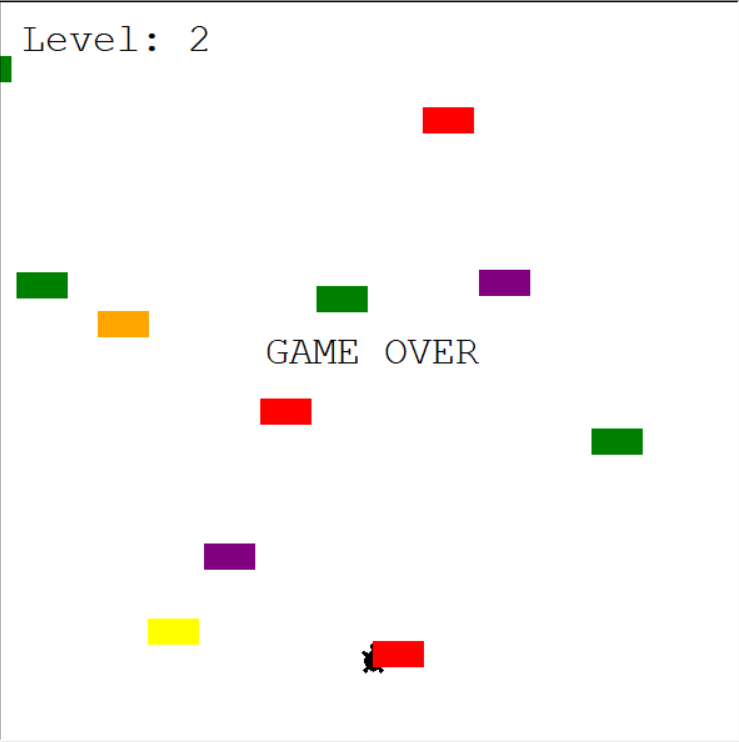

# 🐢 Turtle Crossing Game

A fun **Python Turtle graphics game** where the player helps a turtle cross a busy road while avoiding moving cars. 
The game gets progressively harder as you advance through levels! 


## 📌 About

This project is a simple arcade game built using Python’s **Turtle** module. The goal is to move your turtle from the bottom to the top of the screen while dodging cars that move across the screen. 
With each successful crossing, the difficulty increases!

## 🎮 Demo



---

## 🖼️ Screenshots

### Start Screen


### Game Over Screen


---

## 🕹️ Gameplay

- 🐢 Use the **Up Arrow** key to move the turtle forward  
- 🚗 Avoid colliding with cars  
- 🏁 Reach the top to score points and level up  
- 💥 If you hit a car — Game Over!

---

## 🚀 Features

- 🐢 Player-controlled turtle character  
- 🚗 Randomly generated moving cars  
- 📈 Progressive difficulty as levels increase  
- 💥 Collision detection with game-over logic  
- 🏆 Scoreboard displaying current level  
- 🎨 Clean object-oriented design 

---

## 📂 Project Structure

```text
Turtle-Crossing-Game/
│
├── main.py              # Game loop and main execution
├── player.py            # Turtle player logic
├── car_manager.py       # Car generation and movement
├── scoreboard.py        # Level tracking and display
├── assets/
│   ├── start_screen.png
│   ├── end_screen.png
│   └── demo.gif
└── README.md
```

## 🐢 Enjoy the Game

   ```bash
    git clone https://github.com/aman-Tomar-30/Turtle-Crossing-Game.git
    cd Turtle-Crossing-Game
    python main.py

   ```